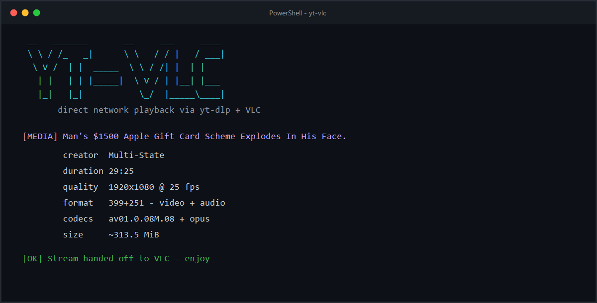
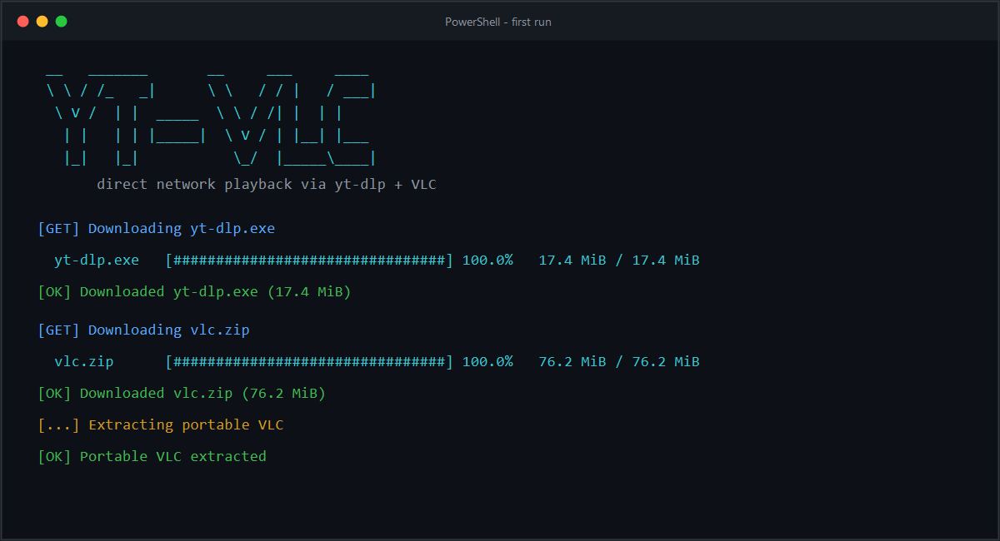

# yt-vlc


A Windows media-playback bridge powered by yt-dlp and VLC, with a polished
command-line interface and an optional Discord request bot.

`yt-vlc` resolves a media page into direct network streams with `yt-dlp -g`
and hands those streams to VLC. It supports combined media as well as separate
video and audio streams without downloading the complete file first.

| Mode | Best for |
|---|---|
| CLI | Opening a URL directly in VLC from PowerShell |
| Discord bot | Running a requestable VLC player with optional automatic Canary sharing |

## Highlights

- Resolves media supported by yt-dlp and opens it directly in VLC
- Prefers combined playback at 720p or better, then separate streams up to 1080p
- Displays download progress, resolution details, codecs, duration, and size
- Downloads pinned portable builds of yt-dlp, Deno, and VLC on first use
- Keeps one VLC window alive across Discord requests and playlist changes
- Lazily resolves queued URLs so signed stream links do not expire while waiting
- Supports ordered multi-link requests, local media, seeking, and playlist control
- Routes Discord playback through a named Windows audio endpoint
- Redacts credential-bearing debrid URLs from Discord output and logs

## Screenshots

### Stream resolution and playback



### First-run setup



## Requirements

- Windows 10 or later
- Python 3.10 or later
- Internet access for initial setup and network playback
- VB-CABLE with the `CABLE Input` playback endpoint enabled for the default
  VLC audio route

The CLI uses only the Python standard library. The Discord bot additionally
requires `discord.py`, pinned in `requirements.txt`.

## Quick start

Clone the repository and enter it:

```powershell
git clone https://github.com/ThePotato456/yt-vlc.git
Set-Location .\yt-vlc
```

Create a virtual environment and install the bot dependency:

```powershell
python -m venv .venv
.\.venv\Scripts\Activate.ps1
python -m pip install -r .\requirements.txt
```

Open a media page in VLC:

```powershell
python .\yt_vlc.py "https://www.youtube.com/watch?v=VIDEO_ID"
```

The first run downloads the pinned Windows tools into `./bin`. Subsequent runs
reuse them.

```text
bin/
|-- deno.exe
|-- yt-dlp.exe
`-- vlc/
    |-- vlc.exe
    |-- libvlc.dll
    |-- libvlccore.dll
    `-- plugins/
```

The generated `bin/` directory is excluded from Git.

## Command-line usage

Pass a media-page URL directly, or omit it to enter one interactively:

```powershell
python .\yt_vlc.py "URL"
python .\yt_vlc.py
```

```text
usage: yt_vlc.py [-h] [-f FORMAT] [--yt-dlp PATH] [--deno PATH]
                 [--vlc PATH] [--print-only] [url]
```

| Option | Description |
|---|---|
| `url` | Media-page URL; prompted for when omitted |
| `-f`, `--format FORMAT` | yt-dlp format selector |
| `--yt-dlp PATH` | Use a specific yt-dlp executable |
| `--deno PATH` | Use a specific Deno executable |
| `--vlc PATH` | Use a specific VLC executable |
| `--print-only` | Print resolved stream URLs without opening VLC |
| `-h`, `--help` | Show the complete colorized help message |

Examples:

```powershell
# Print the resolved stream URL or URLs
python .\yt_vlc.py --print-only "URL"

# Select exact video and audio format IDs
python .\yt_vlc.py -f "137+140" "URL"

# Use existing tool installations
python .\yt_vlc.py `
  --yt-dlp "C:\Tools\yt-dlp.exe" `
  --deno "C:\Tools\deno.exe" `
  --vlc "C:\Program Files\VideoLAN\VLC\vlc.exe" `
  "URL"
```

Running the CLI again reuses VLC and replaces the currently playing item.

### Format selection

Available formats vary by source. List them with:

```powershell
.\bin\yt-dlp.exe -F "URL"
```

Then pass a selector using `-f` or `--format`:

```powershell
python .\yt_vlc.py -f "bv*[height<=1080]+ba/b[height<=1080]" "URL"
```

| Selector | Behavior |
|---|---|
| `best` or `b` | Best combined video and audio stream |
| `bestvideo+bestaudio` or `bv+ba` | Best separate video and audio streams |
| `bestvideo*+bestaudio/best` | Best quality with a combined fallback |
| `bv*[height<=1080]+ba/b[height<=1080]` | Best stream up to 1080p |
| `bv*[height<=720]+ba/b[height<=720]` | Best stream up to 720p |
| `bestaudio` or `ba` | Best audio-only stream |
| `bv*[ext=mp4]+ba[ext=m4a]/b[ext=mp4]` | Prefer MP4 video and M4A audio |
| `137+140` | Combine exact format IDs reported by `-F` |

The default selector is:

```text
b[height>=720][height<=1080]/bv*[height<=1080]+ba/b[height<=1080]/b
```

It first prefers a combined stream between 720p and 1080p. If unavailable, it
tries separate video and audio up to 1080p, followed by compatibility fallbacks.

## Discord request bot

The optional bot turns VLC into a requestable player. It maintains an ordered,
lazy queue while keeping the same VLC window open for Discord application
sharing.

### Bot setup

1. Create an application and bot in the
   [Discord Developer Portal](https://discord.com/developers/applications).
2. Enable **Message Content Intent** for the bot.
3. Invite it with these permissions:

   - View Channels
   - Send Messages
   - Read Message History
   - Manage Messages

4. Copy the example configuration:

   ```powershell
   Copy-Item .\.env.example .\.env
   ```

5. Add the bot token and, when desired, the guild and request-channel IDs:

   ```dotenv
   DISCORD_BOT_TOKEN=
   DISCORD_GUILD_ID=
   DISCORD_REQUEST_CHANNEL_ID=
   ```

6. Confirm the default audio route in `.env`:

   ```dotenv
   VLC_AUDIO_OUTPUT=mmdevice
   VLC_AUDIO_DEVICE=CABLE Input
   ```

7. To have the logged-in Discord Canary account automatically join and share
   VLC, install the bundled `vencord-plugin/ytVlcRemote.desktop` userplugin:

   - Use a current Vencord checkout and link or copy the directory to
     `Vencord/src/userplugins/ytVlcRemote.desktop`.
   - Build Vencord and inject that build into **Discord Canary**, then enable
     **YtVlcRemote** and restart Canary.
   - In the plugin settings, copy the generated bearer token.
   - Enable Developer Mode in Discord, right-click the target ordinary guild
     voice channel, and copy its ID.
   - Add the client settings to `.env`:

     ```dotenv
     DISCORD_CLIENT_API_URL=http://127.0.0.1:38423
     DISCORD_CLIENT_API_TOKEN=the-token-copied-from-canary
     DISCORD_VOICE_CHANNEL_ID=234567890123456789
     ```

   Do not install this userplugin into Discord Stable. The native server also
   refuses to start unless its host executable is Discord Canary.

8. Start the bot:

   ```powershell
   .\start.bat
   ```

At startup, the bot prepares its tools and opens an idle VLC window. When the
client bridge is configured, it asks Canary once to join the configured voice
channel, self-mute/deafen, and share that exact bot-owned VLC window with audio
at 720p/30 FPS. The combined session waits 1.5 seconds after voice connection
confirmation before starting the stream so Discord's media state can settle.
Transient failures retry in the background after 1, 2, 5, 10, and then
30-second intervals, so bot commands remain usable. Permanent failures such as
bad authentication or missing permissions stop retrying and require `!connect`
after correction. A replacement VLC PID triggers a fresh request. After
successful setup, a manual disconnect is not continuously reversed, and
stopping the bot does not leave voice or stop the stream. The bot owner can use
`!connect` to explicitly rejoin after an AFK move or disconnect and
`!disconnect` to stop sharing and leave voice. These commands leave VLC and
media playback running.

### Audio routing

With the default configuration, the bot resolves `CABLE Input` to its current
Windows MMDevice endpoint ID and pins VLC to it. If the endpoint is missing,
disabled, or ambiguous, startup fails with a clear error instead of silently
routing private playback audio through the default speakers.

`VLC_AUDIO_DEVICE` accepts either the complete Windows friendly name or an
MMDevice endpoint ID. Restart the bot after changing audio settings.

### Configuration

| Variable | Default | Purpose |
|---|---|---|
| `DISCORD_BOT_TOKEN` | Required | Discord bot token |
| `DISCORD_GUILD_ID` | Automatic for one visible guild | Guild controlled by commands sent in that guild or by owner-only DMs |
| `DISCORD_REQUEST_CHANNEL_ID` | Any allowed guild channel | Restrict public commands to one channel |
| `DISCORD_CLIENT_API_URL` | `http://127.0.0.1:38423` | IPv4-loopback YtVlcRemote endpoint; only used when token and voice channel are set |
| `DISCORD_CLIENT_API_TOKEN` | Disabled | Bearer token copied from the Canary plugin settings |
| `DISCORD_VOICE_CHANNEL_ID` | Disabled | Ordinary guild voice channel joined by the logged-in Canary account |
| `DISCORD_LOG_LEVEL` | `INFO` | `DEBUG`, `INFO`, `WARNING`, `ERROR`, or `CRITICAL` |
| `DISCORD_LOG_FILE` | `logs/discord_bot.log` | Rotating log path; use `off` for console-only logging |
| `VLC_AUDIO_OUTPUT` | `mmdevice` | VLC audio module: `mmdevice`, `directsound`, `waveout`, or `automatic` |
| `VLC_AUDIO_DEVICE` | `CABLE Input` | Friendly name or endpoint ID selected when using MMDevice |

Never commit `.env`. It is excluded by `.gitignore`.

### Commands

| Command | Behavior |
|---|---|
| `!connect`, `!join`, `!reconnect` | Owner-only: join the configured voice channel and share the bot-owned VLC window |
| `!disconnect`, `!leave` | Owner-only: stop sharing and leave voice without closing VLC |
| `!play <URL> [URL ...]`, `!p <URL> [URL ...]` | Queue one or more URLs in the provided order |
| `!local`, `!localqueue`, `!media` | Browse and queue files beneath `./media` |
| `!pause` | Pause the active VLC item |
| `!resume` | Resume the active VLC item |
| `!skip`, `!s` | Advance to the next VLC item or pending request |
| `!seek <position>` | Seek to an absolute position or move relative to the current time |
| `!stop` | Stop playback and clear pending bot requests without closing VLC |
| `!clear`, `!clearplaylist` | Clear VLC's playlist and all pending requests without closing VLC |
| `!queue`, `!q` | Show pending requests and VLC's live playlist |

Seek values accept seconds, `MM:SS`, or `HH:MM:SS`:

```text
!seek 90       # absolute position: 1:30
!seek 01:30    # absolute position: 1:30
!seek +10      # forward 10 seconds
!seek -05:00   # back 5 minutes
```

Queue up to 25 links in one command by separating them with spaces:

```text
!play https://example.com/first https://example.com/second https://example.com/third
```

The complete batch is validated before any request is accepted. Playback
controls operate on VLC itself, so they also work with items added manually in
VLC.

### Queue behavior

Each guild has independent in-memory state. A URL is not resolved until it
reaches the front of the queue, preventing short-lived signed stream URLs from
expiring while they wait. The bot may pre-resolve only the next request near the
end of the current item to reduce transition time.

`!queue` merges pending bot requests with VLC's native playlist. It therefore
includes media added outside Discord, and safely truncates long playlists to
Discord's embed limits.

### Local media

Run `!local` to open a requester-scoped browser rooted at `./media`. The
directory is created when needed and supports common audio and video formats,
including MP4, MKV, WebM, MOV, AVI, MP3, M4A, FLAC, WAV, OGG, and Opus.

The browser supports folder navigation, pagination, individual files, and
whole-folder queueing in one VLC operation. New items append to the existing
playlist and the first item starts automatically when VLC is idle.

Every path is resolved beneath `./media` before use. Escaping paths are rejected
and absolute local paths are never displayed in Discord. The directory is also
excluded from Git.

## Privacy and security

- `.env`, logs, downloaded tools, local media, and Python environments are
  excluded from Git.
- VLC's control interface binds to `127.0.0.1` and receives a new random
  password on each bot launch.
- The optional Canary bridge binds only to IPv4 loopback, requires a generated
  bearer token, rejects browser Origin and unexpected Host requests, limits
  request size and queue depth, and never returns thumbnails or signed URLs.
- Screen sharing requires an exact match between the bot-owned VLC PID,
  executable path, Windows main-window handle, and a window capture source.
  Full-display fallback is intentionally absent.
- Owner-only DM commands can control the configured guild; other DM users are
  rejected.
- Credential-bearing TorBox, Real-Debrid, AllDebrid, Premiumize, and similar
  URLs are redacted from responses, queue displays, and logs.
- Public messages containing sensitive links are deleted before acceptance. A
  request is rejected if the message cannot be deleted.
- Cookie retries accept one requester-scoped Netscape `cookies.txt` upload in
  DM, filter it to the requested service, and use it for one retry. The upload
  is deleted immediately when Discord permits it.

Cookies and authenticated stream URLs are sensitive. Use a dedicated bot,
limit its permissions to the intended server, and rotate credentials if they
are exposed.

## How it works

1. The program ensures the pinned tools exist beneath `./bin`.
2. yt-dlp resolves the requested page with the chosen format and bundled Deno
   runtime.
3. VLC opens a combined stream directly, or attaches a separate audio URL using
   the item-specific `input-slave` option.
4. CLI launches reuse VLC and replace the active item.
5. The Discord bot keeps a dedicated VLC process alive and controls its
   playlist through a password-protected local HTTP interface.

## Troubleshooting

### `CABLE Input` is not active

Confirm VB-CABLE is installed and that its playback endpoint is enabled in
Windows sound settings. If the endpoint uses a different name, copy that name
to `VLC_AUDIO_DEVICE` in `.env`, then restart the bot.

The bot intentionally does not fall back to another output device.

### VLC opens but the bot cannot control it

The bot waits for VLC's local interface and retries initialization once with a
new port and password. Check `logs/discord_bot.log` and confirm security
software is not blocking localhost connections.

### The requested format is unavailable

List the source's formats with `yt-dlp -F`, then choose a compatible selector
with `-f`. Availability can differ between public and authenticated extraction.

### Discord viewers hear distorted audio

Verify that Windows, VB-CABLE, and the receiving application use compatible
sample-rate and channel settings. Keep the MMDevice route configured so VLC
does not move back to the default output while troubleshooting.

### The Canary client bridge is unavailable

Confirm Canary is running, YtVlcRemote is enabled, Canary was restarted after a
port change, and `DISCORD_CLIENT_API_URL` uses the same port. Another process
may already own port `38423`; choose an unused port in the plugin settings,
restart Canary, and update `.env`.

### The bridge returns `unauthorized`

Copy the token again from YtVlcRemote settings. Regenerating it invalidates the
old value immediately. Keep it out of logs, screenshots, commits, and chat.

### The bridge cannot find VLC

The plugin accepts only the exact `vlc.exe` PID and executable path supplied by
this bot. Wait for the idle VLC window to appear and ensure it is not minimized
to the notification area. A display will never be substituted for a missing
VLC window.

### Discord voice or Go Live APIs are unavailable

Discord's renderer internals can change. Update Vencord, rebuild the userplugin,
and restart Canary. The REST bridge returns `discord_api_unavailable` rather
than attempting unknown internals. Also confirm the account has View Channel,
Connect, and Stream permission in an ordinary guild voice channel.

### Playback stalls

If playback time stops advancing for 12 seconds, the bot makes one recovery
attempt using a combined-first 720p compatibility selector and resumes near the
previous timestamp when possible.

## Development

Run the test suite from the repository root:

```powershell
python -m unittest discover -s tests -v
```

The suite covers queue behavior, VLC control, audio routing, seeking, local
media, cookie retries, sensitive-link redaction, playback recovery, bridge
configuration and authentication, retry scheduling, duplicate-ready
suppression, and VLC PID replacement.

## Contributing

Bug reports and focused pull requests are welcome. Include the playback source,
expected behavior, actual behavior, and relevant redacted logs. Never publish
authentication cookies, bot tokens, signed media URLs, or private local paths.

## Responsible use

This project is a playback helper around yt-dlp and VLC. Supported sites and
formats can change over time. Use it only with media you are authorized to
access, and follow applicable service terms and local laws.
